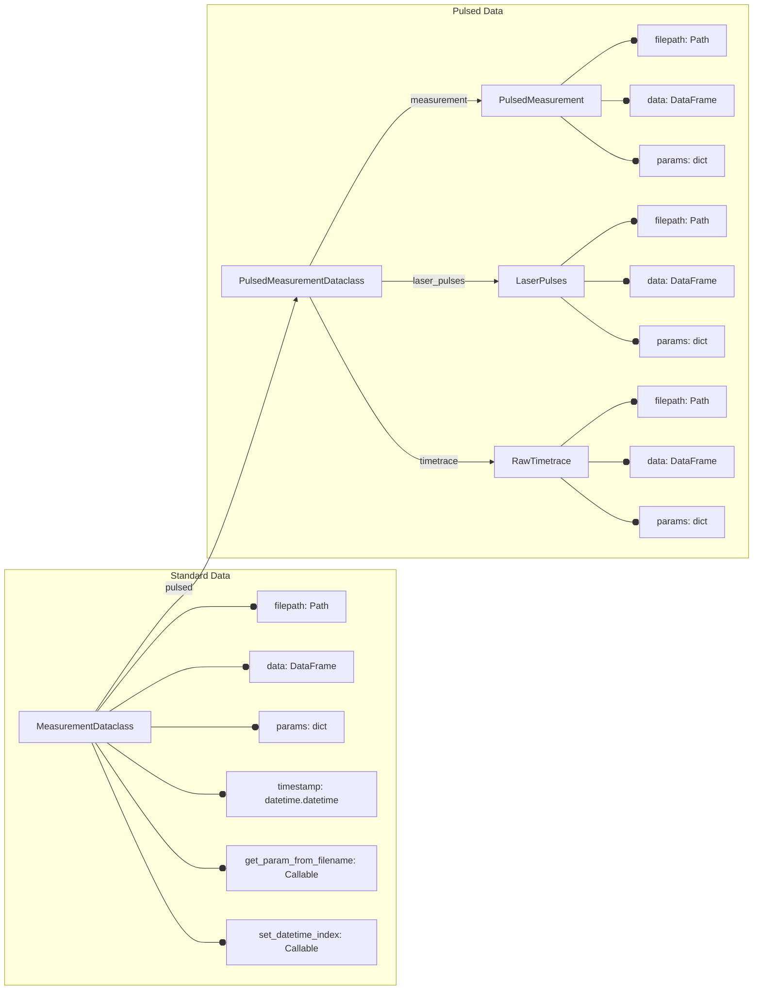
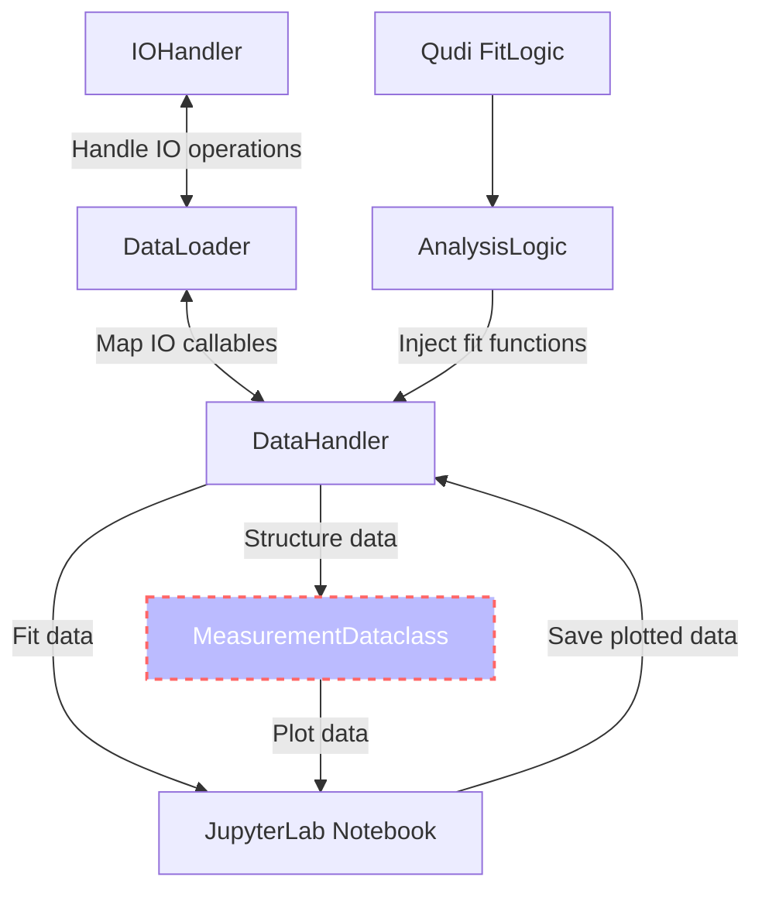

[](https://zenodo.org/badge/latestdoi/288670453)
[](https://pypi.python.org/pypi/qudi-hira-analysis/)
[](https://pepy.tech/project/qudi-hira-analysis)
[](https://codecov.io/gh/dineshpinto/qudi-hira-analysis)
[](https://github.com/dineshpinto/qudi-hira-analysis/actions/workflows/cross-platform-unittest.yml)

# Qudi Hira Analysis

This toolkit automates a large portion of the work surrounding data analysis on quantum sensing experiments where the
primary raw data extracted is photon counts.

The high level interface is abstracted, and provides a set of functions to automate data import, handling and analysis.
It is designed to be exposed through Jupyter Notebooks, although the abstract interface allows it to be integrated into
larger, more general frameworks as well (with only some pain). Using the toolkit itself should only require a
beginner-level understanding of Python.

It also aims to improve transparency and reproducibility in experimental data analysis. In an ideal scenario,
two lines of code are sufficient to recreate all output data.

Python offers some very handy features like dataclasses, which are heavily used by this toolkit. Dataclasses offer a
full OOP (object-oriented programming) experience while analyzing complex data sets. They provide a solid and
transparent structure to the data to
reduce errors arising from data fragmentation. This generally comes at a large performance cost, but this is (largely)
sidestepped by lazy loading data and storing metadata instead wherever possible.

## Installation

```bash
pip install qudi-hira-analysis
```

### Update to latest version

```bash
pip install --upgrade qudi-hira-analysis
```

## Citation

If you are publishing scientific results using this code, you should cite this work as:  https://doi.org/10.5281/zenodo.7604670


## Features

- Modular architecture (use only what you need)
- Automated data import and handling
- Works natively with data from [Qudi](https://github.com/Ulm-IQO/qudi)
- Supports all fitting routines and file formats used in NV magnetometry, AFM, MFM and NV-SPM
- Uses a Dataclass-centered design for easy access to data and metadata


## Usage

```python
from pathlib import Path
from qudi_hira_analysis import DataHandler

dh = DataHandler(
    data_folder=Path("C:\\", "Data"),
    figure_folder=Path("C:\\", "QudiHiraAnalysis"),
    measurement_folder=Path("20230101_NV1")
)

# Load all ODMR measurements
odmr_measurements = dh.load_measurements("odmr")
```

## Documentation

The full documentation is available [here](https://dineshpinto.github.io/qudi-hira-analysis/)

## Dataclass Schema



## Overall Schema



## License

This license of this project is located in the top level folder under `LICENSE`. Some specific files contain their
individual licenses in the file header docstring.

## Build

### Prerequisites

- [Poetry](https://python-poetry.org) 
- [git](https://git-scm.com/downloads)

### Clone the repository

```shell
git clone https://github.com/dineshpinto/qudi-hira-analysis.git
```

### Installing dependencies with Poetry

```bash
poetry install
```

#### Add Poetry environment to Jupyter kernel

```bash
poetry run python -m ipykernel install --user --name=qudi-hira-analysis
```

### Start the analysis

```shell
poetry run jupyter lab
```

Don't forget to switch to the `qudi-hira-analysis` kernel in JupyterLab.

## Makefile

The Makefile located in `notebooks/` is configured to generate a variety of outputs:

+ `make pdf` : Converts all notebooks to PDF (requires LaTeX backend)
+ `make html`: Converts all notebooks to HTML
+ `make py`  : Converts all notebooks to Python (can be useful for VCS)
+ `make all` : Sequentially runs all the notebooks in folder

To use the `make` command on Windows you can install [Chocolatey](https://chocolatey.org/install), then
install make with `choco install make`
