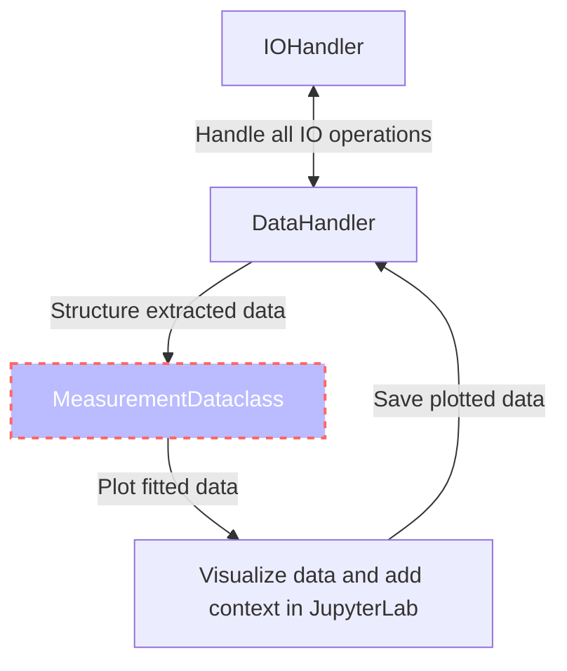
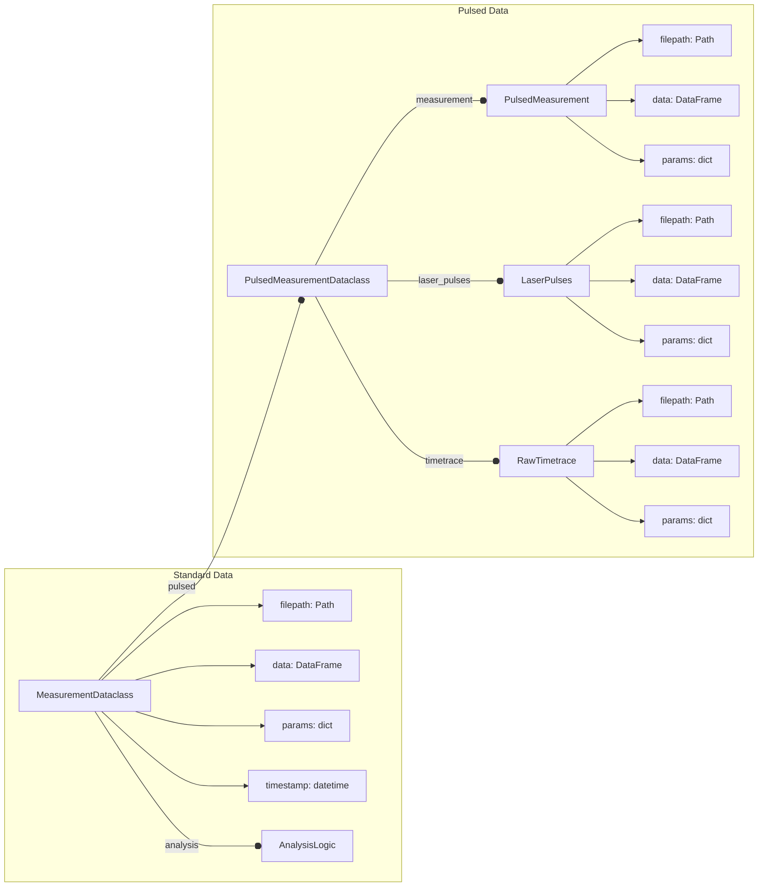

# Qudi Hira Analysis

This toolkit automates a large portion of the work surrounding data analysis on quantum sensing experiments where the
primary raw data extracted is photon counts.

The high level interface is abstracted, and provides a set of functions to automate data import, handling and analysis.
It is designed to be exposed through Jupyter Notebooks, although the abstract interface allows it to be integrated into
larger, more general frameworks as well (with only some pain). Using the toolkit itself should only require a
beginner-level understanding of Python.

It also aims to improve transparency and reproducibility in experimental data analysis. In an ideal scenario,
two lines of code are sufficient to recreate all output data.

Python offers some very handy features like dataclasses, which are heavily used by this toolkit. Dataclasses offer a
full OOP (object-oriented programming) experience while analyzing complex data sets. They provide a solid and
transparent structure to the data to
reduce errors arising from data fragmentation. This generally comes at a large performance cost, but this is (largely)
sidestepped by lazy loading data and storing metadata instead wherever possible.

The visual structure of the toolkit is shown in the schema below. It largely consists of three portions:

- `IOHandler` assumes a central store of raw data, which is never modified (read-only)
- `DataHandler` automates the extraction of large amounts of data from the `IOHandler` interface
- `AnalysisLogic` contains a set of automated fitting routines using `lmfit` internally (built on top of fitting
  routines from the [qudi](https://github.com/Ulm-IQO/qudi) project)

This license of this project is located in the top level folder under `LICENSE`. Some specific files contain their
individual licenses in the file header docstring.

## Schema

### Overall



### Measurement Dataclass



## Supports common fitting routines

Fit routines included in `AnalysisLogic`

| Dimension | Fit                           |
|-----------|-------------------------------|
| 1d        | decayexponential              |
|           | biexponential                 |
|           | decayexponentialstretched     |
|           | gaussian                      |
|           | gaussiandouble                |
|           | gaussianlinearoffset          |
|           | hyperbolicsaturation          |
|           | linear                        |
|           | lorentzian                    |
|           | lorentziandouble              |
|           | lorentziantriple              |
|           | sine                          |
|           | sinedouble                    |
|           | sinedoublewithexpdecay        |
|           | sinedoublewithtwoexpdecay     |
|           | sineexponentialdecay          |
|           | sinestretchedexponentialdecay |
|           | sinetriple                    |
|           | sinetriplewithexpdecay        |
|           | sinetriplewiththreeexpdecay   |
| 2d        | twoDgaussian                  |

## Inbuilt measurement tree visualizer

```ipython
tip_2S6 = DataHandler(data_folder="C:\\Data", figure_folder="C:\\QudiHiraAnalysis",
                      measurement_folder="20220621_FR0612-F2-2S6_uhv")
tip_2S6.data_folder_tree()

# Output
├── 20211116_NetworkAnalysis_SampleIn_UpperPin.csv
├── 20211116_NetworkAnalysis_SampleOut_UpperPin.csv
├── 20211116_NetworkAnalysis_TipIn_LowerPin.csv
├── 20211116_NetworkAnalysis_TipIn_UpperPin.csv
├── 20211116_NetworkAnalysis_TipOut_LowerPin.csv
├── 20211116_NetworkAnalysis_TipOut_UpperPin.csv
├── ContactTestingMeasurementHead
│   ├── C2_Reference.txt
│   ├── C2_SampleLowerPin.txt
│   ├── C2_SampleUpperPin.txt
│   ├── C2_TipLowerPin.txt
│   └── C2_TipUpperPin.txt
├── Sample_MW_Pin_comparision.png
├── Tip_MW_Pin_comparision.png
└── Tip_Sample_MW_Pin_comparision.png
```

## Automated data extraction from qudi folder structure

```python
from dateutil.parser import parse
import matplotlib.pyplot as plt

from src.data_handler import DataHandler
from src.analysis_logic import FitMethods

# Eg: Plot all rabi oscillations measured in one afternoon and fit them to exponentially decaying double sinusoids

tip_2S6 = DataHandler(data_folder="C:\\Data", figure_folder="C:\\QudiHiraAnalysis",
                      measurement_folder="20220621_FR0612-F2-2S6_uhv")

tip_2S6_rabi_list = tip_2S6.load_measurements_into_dataclass_list(measurement_str="Rabi")
filtered_rabi_list = [rabi for rabi in tip_2S6_rabi_list if
                      parse("10 July 2022 13:30") < rabi.timestamp < parse("10 July 2022 17:30")]

fig, ax = plt.subplots(nrows=len(filtered_rabi_list))

for idx, rabi in enumerate(filtered_rabi_list):
    x, y, yerr = rabi.data["Controlled variable(s)"], rabi.data["Signal"], rabi.data["Error"]
    fit_x, fit_y, result = rabi.analysis.perform_fit(x=x, y=y, fit_function=FitMethods.sinedoublewithexpdecay)

    ax[idx].errorbar(x, y, yerr=yerr, fmt=".")
    ax[idx].plot(fit_x, fit_y, "-")
    ax[idx].set_title(f"Power = {rabi.get_param_from_filename(unit='dBm')}, "
                      f"T1rho = {result.params['Lifetime'].value}")

tip_2S6.save_figures(fig, "compare_rabi_oscillations_at different_powers")
```

For more examples see [ExampleNotebook.ipynb](ExampleNotebook.ipynb)

## Getting Started

### Prerequisites

Latest version of:

- [Poetry](https://python-poetry.org) (recommended) or [conda](https://docs.conda.io/en/latest/miniconda.html) package manager
- [git](https://git-scm.com/downloads) version control system

### Clone the repository

```shell
git clone https://github.com/dineshpinto/qudi-hira-analysis.git
```

### Installing dependencies with Poetry (recommended)
```bash
poetry install
```

#### Add Poetry environment to Jupyter kernel

```bash
poetry run python -m ipykernel install --user --name=qudi-hira-analysis
```

### OR installing dependencies with conda (not recommended)

#### Creating the conda environment

```shell
conda env create -f tools/conda-env-xx.yml
```

where `xx` is either `win10`, `osx-intel` or `osx-apple-silicon`.

#### Activate conda environment

```shell
conda activate qudi-hira-analysis
```

#### Add conda environment to Jupyter kernel

```shell
python -m ipykernel install --user --name=qudi-hira-analysis
```

### Start the analysis

#### If installed with Poetry

```shell
poetry run jupyter lab
```

#### OR with conda

```shell
jupyter lab
```

Don't forget to switch to the `qudi-hira-analysis` kernel in JupyterLab.

## Makefile

The Makefile located in `notebooks/` is configured to generate a variety of outputs:

+ `make pdf` : Converts all notebooks to PDF (requires LaTeX backend)
+ `make html`: Converts all notebooks to HTML
+ `make py`  : Converts all notebooks to Python (can be useful for VCS)
+ `make all` : Sequentially runs all the notebooks in folder

To use the `make` command on Windows you can install [Chocolatey](https://chocolatey.org/install), then
install make with `choco install make`
