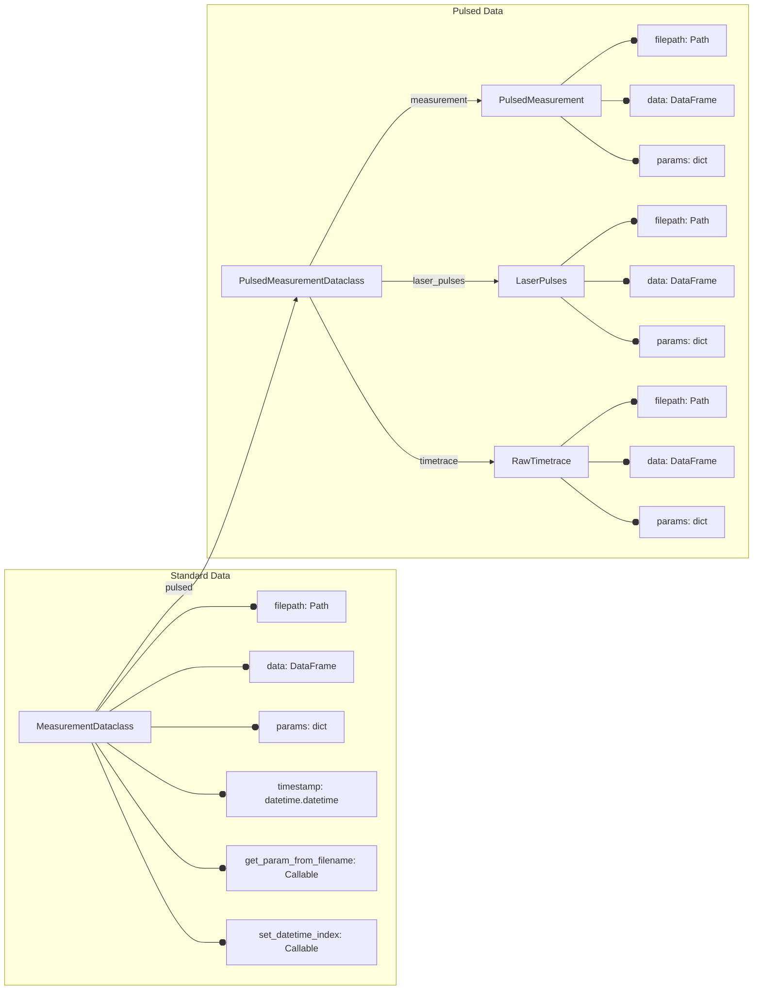
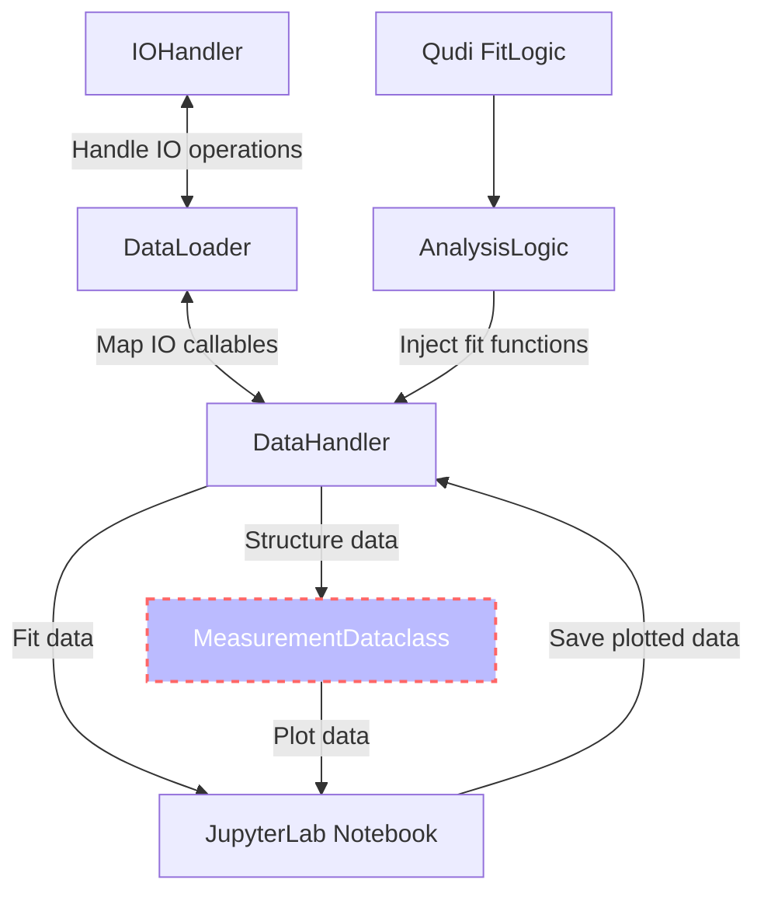

[](https://zenodo.org/badge/latestdoi/288670453)
[](https://pepy.tech/project/qudi-hira-analysis)
[](https://pypi.python.org/pypi/qudi-hira-analysis/)
[](https://www.python.org/downloads/release/python-3100//)
[](https://www.python.org/downloads/release/python-3110//)
[](https://codecov.io/gh/dineshpinto/qudi-hira-analysis)

# Qudi Hira Analysis

This toolkit automates a large portion of the work surrounding data analysis on quantum sensing experiments where the
primary raw data extracted is photon counts.

The high level interface is abstracted, and provides a set of functions to automate data import, handling and analysis.
It is designed to be exposed through Jupyter Notebooks, although the abstract interface allows it to be integrated into
larger, more general frameworks as well (with only some pain). Using the toolkit itself should only require a
beginner-level understanding of Python.

It also aims to improve transparency and reproducibility in experimental data analysis. In an ideal scenario,
two lines of code are sufficient to recreate all output data.

Python offers some very handy features like dataclasses, which are heavily used by this toolkit. Dataclasses offer a
full OOP (object-oriented programming) experience while analyzing complex data sets. They provide a solid and
transparent structure to the data to
reduce errors arising from data fragmentation. This generally comes at a large performance cost, but this is (largely)
sidestepped by lazy loading data and storing metadata instead wherever possible.

## Installation

```bash
pip install qudi-hira-analysis
```

## Citation

If you are publishing scientific results, you can cite this work as:  https://doi.org/10.5281/zenodo.7604670

## Examples

First set up the `DataHandler` object (henceforth referred to as `dh`) with the correct paths to the data and figure
folders.

Everything revolves around the `dh` object. It is the main interface to the toolkit and is initialized with the
following required arguments:

- `data_folder` is the main folder where all the data is stored, it can be the direct path to the data, or composed of
  several sub-folders, each containing the data for a specific measurement
- `figure_folder` is the folder where the output figures will be saved

Optional arguments:

- `measurement_folder` is the specific sub-folder in `data_folder` where the data for a specific measurement is stored

```python
from pathlib import Path
import matplotlib.pyplot as plt
import seaborn as sns

from qudi_hira_analysis import DataHandler

dh = DataHandler(
    data_folder=Path("C:\\", "Data"),
    figure_folder=Path("C:\\", "QudiHiraAnalysis"),
    measurement_folder=Path("20230101_NV1")
)
```

To load a specific set of measurements from the data folder, use the `dh.load_measurements()` method, which takes the
following required arguments:

- `measurement_str` is the string that is used to identify the measurement. It is used to filter the data files in the
  `data_folder` and `measurement_folder` (if specified)

Optional arguments:

- `qudi` is a boolean. If `True`, the data is assumed to be in the format used by Qudi (default: True)
- `pulsed` is a boolean. If `True`, the data is assumed to be in the format used by Qudi for pulsed measurements (
  default: False)
- `extension` is the extension of the data files (default: ".dat")

The `load_measurements` function returns a dictionary containing the measurement data filtered by `measurement_str`.

- The dictionary keys are measurement timestamps in "(year)(month)(day)-(hour)(minute)-(second)" format.

- The dictionary values are `MeasurementDataclass` objects whose schema is shown
  visually [here](#measurement-dataclass-schema).

### Example 0: NV-PL measurements

```python
pixel_scanner_measurements = dh.load_measurements(measurement_str="PixelScanner")

fwd, bwd = pixel_scanner_measurements["20230101-0420-00"].data

# If size is known, it can be specified here
fwd.size["real"] = {"x": 1e-6, "y": 1e-6, "unit": "m"}

fig, ax = plt.subplots()

# Perform (optional) image corrections
fwd.filter_gaussian(sigma=0.5)

# Add scale bar, color bar and plot the data
img = fwd.show(cmap="inferno", ax=ax)
fwd.add_scale(length=1e-6, ax=ax, height=1)
cbar = fig.colorbar(img)
cbar.set_label("NV-PL (kcps)")

# Save the figure to the figure folder specified earlier
dh.save_figures(filepath="nv_pl_scan", fig=fig, only_jpg=True)
```

### Example 1: Nanonis AFM measurements

```python
afm_measurements = dh.load_measurements(measurement_str="Scan", extension=".sxm")

afm = afm_measurements["20230101-0420-00"].data

# Print the channels available in the data
afm.list_channels()
topo = afm.get_channel("Z")

fig, ax = plt.subplots()

# Perform (optional) image corrections
topo.correct_lines()
topo.correct_plane()
topo.filter_lowpass(fft_radius=20)
topo.zero_min()

# Add scale bar, color bar and plot the data
img = topo.show(cmap="inferno", ax=ax)
topo.add_scale(length=1e-6, ax=ax, height=1, fontsize=10)
cbar = fig.colorbar(img)
cbar.set_label("Height (nm)")

dh.save_figures(filepath="afm_topo", fig=fig, only_jpg=True)
``` 

### Example 2: Autocorrelation measurements (Antibunching fit)

```python
autocorrelation_measurements = dh.load_measurements(measurement_str="Autocorrelation")

fig, ax = plt.subplots()

for autocorrelation in autocorrelation_measurements.values():
  autocorrelation.data["Time (ns)"] = autocorrelation.data["Time (ps)"] * 1e-3
  # Plot the data
  sns.lineplot(data=autocorrelation.data, x="Time (ns)", y="g2(t) norm", ax=ax)
  # Fit the data using the antibunching function
  fit_x, fit_y, result = dh.fit(x="Time (ns)", y="g2(t) norm", data=autocorrelation.data,
                                fit_function=dh.fit_function.antibunching)
  # Plot the fit
  sns.lineplot(x=fit_x, y=fit_y, ax=ax, color="C1")

# Save the figure to the figure folder specified earlier
dh.save_figures(filepath="autocorrelation_variation", fig=fig)
```

### Example 3: ODMR measurements (double Lorentzian fit)

```python
odmr_measurements = dh.load_measurements(measurement_str="ODMR", pulsed=True)

fig, ax = plt.subplots()

for odmr in odmr_measurements.values():
    sns.scatterplot(data=odmr.data, x="Controlled variable(Hz)", y="Signal", ax=ax)
    fit_x, fit_y, result = dh.fit(x="Controlled variable(Hz)", y="Signal", data=odmr.data,
                                  fit_function=dh.fit_function.lorentziandouble)
    sns.lineplot(x=fit_x, y=fit_y, ax=ax, color="C1")

dh.save_figures(filepath="odmr_variation", fig=fig)
```

### Example 4: Rabi measurements (sine exponential decay fit)

```python
rabi_measurements = dh.load_measurements(measurement_str="Rabi", pulsed=True)

fig, ax = plt.subplots()

for rabi in rabi_measurements.values():
    sns.scatterplot(data=rabi.data, x="Controlled variable(s)", y="Signal", ax=ax)
    fit_x, fit_y, result = dh.fit(x="Controlled variable(s)", y="Signal", data=rabi.data,
                                  fit_function=dh.fit_function.sineexponentialdecay)
    sns.lineplot(x=fit_x, y=fit_y, ax=ax, color="C1")

dh.save_figures(filepath="rabi_variation", fig=fig)
```

### Example 5: Temperature data

```python
temperature_measurements = dh.load_measurements(measurement_str="Temperature")

temperature = pd.concat([t.data for t in temperature_measurements.values()])

fig, ax = plt.subplots()
sns.lineplot(data=temperature, x="Time", y="Temperature", ax=ax)
dh.save_figures(filepath="temperature_monitoring", fig=fig)
```

## Measurement Dataclass Schema



## Supports common fitting routines

To get the full list of available fit routines, use the `dh.fit_function` attribute. The fit functions are:

| Dimension | Fit                           |
|-----------|-------------------------------|
| 1d        | decayexponential              |
|           | biexponential                 |
|           | decayexponentialstretched     |
|           | gaussian                      |
|           | gaussiandouble                |
|           | gaussianlinearoffset          |
|           | hyperbolicsaturation          |
|           | linear                        |
|           | lorentzian                    |
|           | lorentziandouble              |
|           | lorentziantriple              |
|           | sine                          |
|           | sinedouble                    |
|           | sinedoublewithexpdecay        |
|           | sinedoublewithtwoexpdecay     |
|           | sineexponentialdecay          |
|           | sinestretchedexponentialdecay |
|           | sinetriple                    |
|           | sinetriplewithexpdecay        |
|           | sinetriplewiththreeexpdecay   |
| 2d        | twoDgaussian                  |

## Inbuilt measurement tree visualizer

```ipython
>>> dh.data_folder_tree()

# Output
├── 20211116_NetworkAnalysis_SampleIn_UpperPin.csv
├── 20211116_NetworkAnalysis_SampleOut_UpperPin.csv
├── 20211116_NetworkAnalysis_TipIn_LowerPin.csv
├── 20211116_NetworkAnalysis_TipIn_UpperPin.csv
├── 20211116_NetworkAnalysis_TipOut_LowerPin.csv
├── 20211116_NetworkAnalysis_TipOut_UpperPin.csv
├── ContactTestingMeasurementHead
│   ├── C2_Reference.txt
│   ├── C2_SampleLowerPin.txt
│   ├── C2_SampleUpperPin.txt
│   ├── C2_TipLowerPin.txt
│   └── C2_TipUpperPin.txt
├── Sample_MW_Pin_comparision.png
├── Tip_MW_Pin_comparision.png
└── Tip_Sample_MW_Pin_comparision.png
```

## Overall Schema



## License

This license of this project is located in the top level folder under `LICENSE`. Some specific files contain their
individual licenses in the file header docstring.

## Build

### Prerequisites

Latest version of:

- [Poetry](https://python-poetry.org) (recommended) or [conda](https://docs.conda.io/en/latest/miniconda.html) package
  manager
- [git](https://git-scm.com/downloads) version control system

### Clone the repository

```shell
git clone https://github.com/dineshpinto/qudi-hira-analysis.git
```

### Installing dependencies with Poetry

```bash
poetry install
```

#### Add Poetry environment to Jupyter kernel

```bash
poetry run python -m ipykernel install --user --name=qudi-hira-analysis
```

### OR installing dependencies with conda

#### Creating the conda environment

```shell
conda env create -f tools/conda-env-xx.yml
```

where `xx` is either `win10`, `osx-intel` or `osx-apple-silicon`.

#### Activate conda environment

```shell
conda activate qudi-hira-analysis
```

#### Add conda environment to Jupyter kernel

```shell
python -m ipykernel install --user --name=qudi-hira-analysis
```

### Start the analysis

#### If installed with Poetry

```shell
poetry run jupyter lab
```

#### OR with conda

```shell
jupyter lab
```

Don't forget to switch to the `qudi-hira-analysis` kernel in JupyterLab.

## Makefile

The Makefile located in `notebooks/` is configured to generate a variety of outputs:

+ `make pdf` : Converts all notebooks to PDF (requires LaTeX backend)
+ `make html`: Converts all notebooks to HTML
+ `make py`  : Converts all notebooks to Python (can be useful for VCS)
+ `make all` : Sequentially runs all the notebooks in folder

To use the `make` command on Windows you can install [Chocolatey](https://chocolatey.org/install), then
install make with `choco install make`
