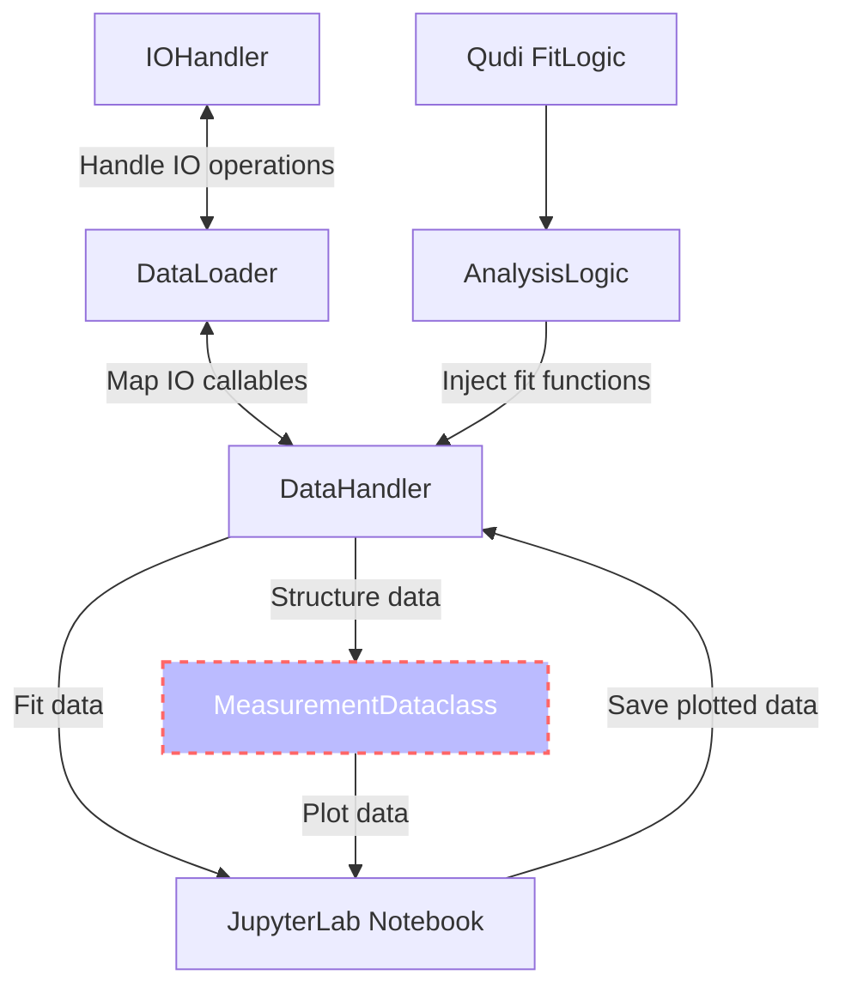
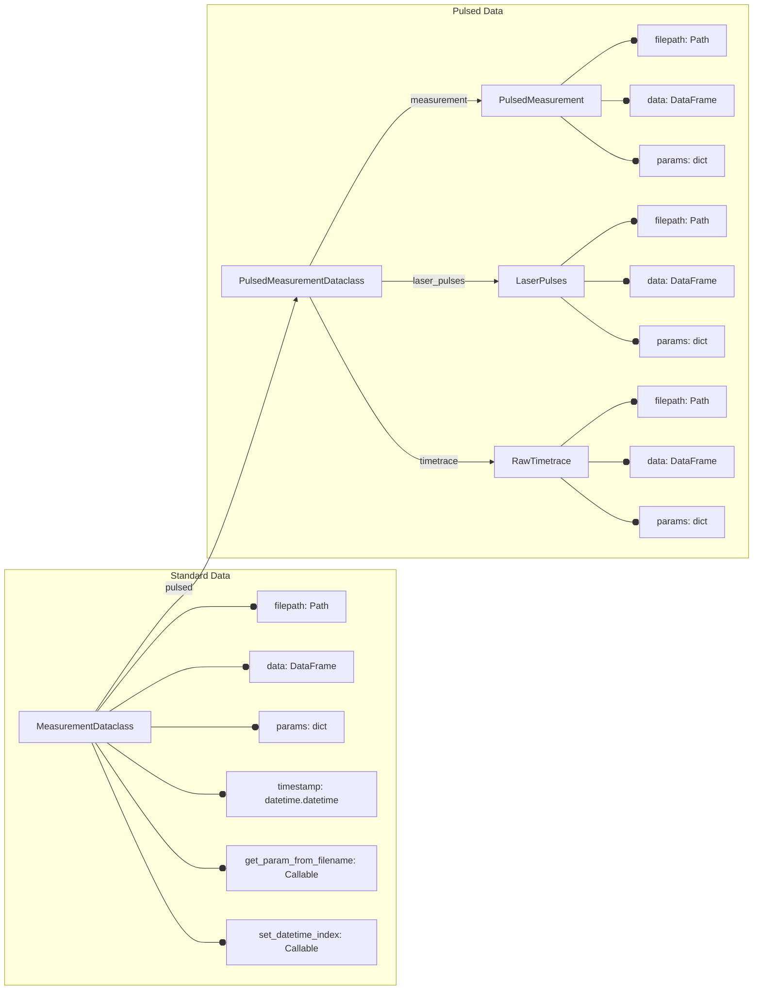

[](https://zenodo.org/badge/latestdoi/288670453)
[](https://pypi.python.org/pypi/qudi-hira-analysis/)
[](https://www.python.org/downloads/release/python-3100/)
[](https://pepy.tech/project/qudi-hira-analysis)
[](https://codecov.io/gh/dineshpinto/qudi-hira-analysis)
[](https://github.com/dineshpinto/qudi-hira-analysis/actions/workflows/unittest.yml)

# Qudi Hira Analysis

Analytics suite for qubit SPM using FPGA timetaggers

## Installation

```bash
pip install qudi-hira-analysis
```

### Update to latest version

```bash
pip install --upgrade qudi-hira-analysis
```

## Citation

If you are publishing scientific results that use this code, as good scientific practice you
should cite [this work](https://doi.org/10.5281/zenodo.7604670).

## Features

- Automated data import and handling
- Works natively with data from [Qudi](https://github.com/Ulm-IQO/qudi) and [Qudi-Hira](https://github.com/projecthira/qudi-hira)
- Fast and robust curve fitting for NV-ODMR 2D maps, Autocorrelation, Rabi, Ramsey, T1, T2 and more...
- Supports all file formats used in NV magnetometry, AFM, MFM and NV-SPM
- Uses a Dataclass-centered design for easy access to data and metadata

## Usage

```python
from pathlib import Path
import seaborn as sns

from qudi_hira_analysis import DataHandler

dh = DataHandler(
    data_folder=Path("C:/Data"),  # Path to data folder
    figure_folder=Path("C:/QudiHiraAnalysis"),  # Path to figure folder
    measurement_folder=Path("20230101_NV1")  # Measurement folder name (optional)
)

# Lazy-load all pulsed measurements with "odmr" in the path into a Dataclass
odmr_measurements = dh.load_measurements("odmr", pulsed=True)

# Fit ODMR data with a double Lorentzian
odmr = odmr_measurements["20230101-0420-00"]
x_fit, y_fit, result = dh.fit(x="Controlled variable(Hz)", y="Signal",
                              fit_function=dh.fit_function.lorentziandouble, data=odmr.data)

# Plot the data and the fit
ax = sns.scatterplot(x="Controlled variable(Hz)", y="Signal", data=odmr.data, label="Data")
sns.lineplot(x=x_fit, y=y_fit, ax=ax, label="Fit")

# Calculate the ODMR splitting
ax.axvline(result.best_values["l0_center"], ls="--", color="C1")
ax.axvline(result.best_values["l1_center"], ls="--", color="C1")
splitting = result.best_values["l1_center"] - result.best_values["l0_center"]
ax.set_title(f"ODMR splitting = {splitting / 1e6:.1f} MHz")

# Generate fit report
print(result.fit_report())

# Save figure
dh.save_figures(filepath=Path("odmr_fit"), fig=ax.get_figure())
```


## Documentation

The full documentation is available [here](https://dineshpinto.github.io/qudi-hira-analysis/).

## Schema

### Overall



### Dataclass



## License

This license of this project is located in the top level folder under `LICENSE`. Some specific files contain their
individual licenses in the file header docstring.

## Build

### Prerequisites

- [Poetry](https://python-poetry.org)
- [git](https://git-scm.com/downloads)

### Clone repo, install deps and add environment to Jupyter

```shell
git clone https://github.com/dineshpinto/qudi-hira-analysis.git
cd qudi-hira-analysis
poetry install
poetry run python -m ipykernel install --user --name=qudi-hira-analysis
poetry run jupyter lab
```

## Makefile

The Makefile located in `notebooks/` is configured to generate a variety of outputs:

+ `make pdf` : Converts all notebooks to PDF (requires LaTeX backend)
+ `make html`: Converts all notebooks to HTML
+ `make py`  : Converts all notebooks to Python (can be useful for VCS)
+ `make all` : Sequentially runs all the notebooks in folder

To use the `make` command on Windows you can install [Chocolatey](https://chocolatey.org/install), then
install make with `choco install make`
