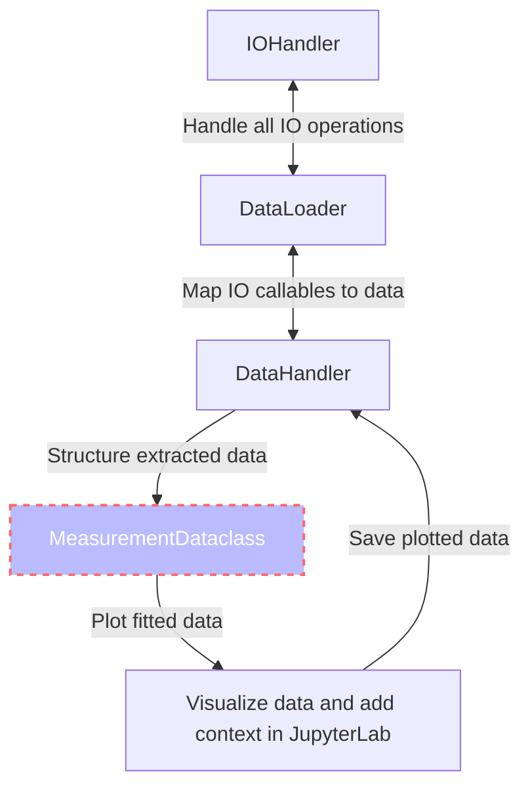
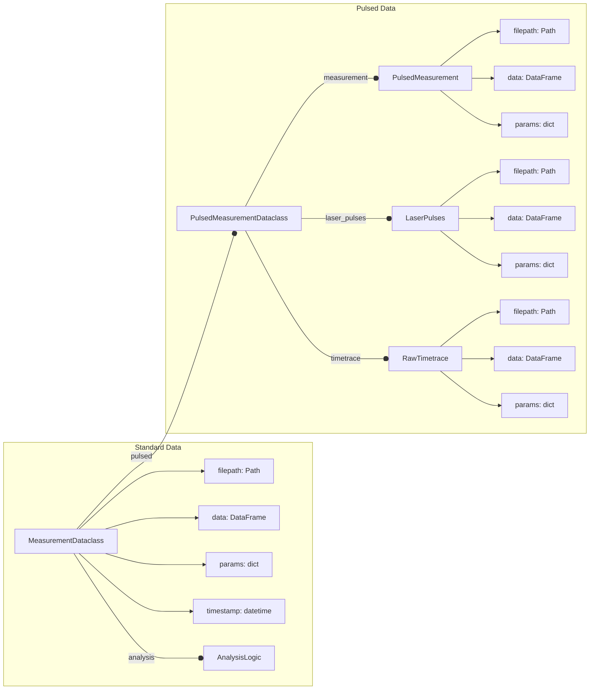

[](https://zenodo.org/badge/latestdoi/288670453)
[](https://pepy.tech/project/qudi-hira-analysis)
[](https://pypi.python.org/pypi/qudi-hira-analysis/)
[](https://www.python.org/downloads/release/python-3100//)
[](https://www.python.org/downloads/release/python-3110//)

# Qudi Hira Analysis

This toolkit automates a large portion of the work surrounding data analysis on quantum sensing experiments where the
primary raw data extracted is photon counts.

The high level interface is abstracted, and provides a set of functions to automate data import, handling and analysis.
It is designed to be exposed through Jupyter Notebooks, although the abstract interface allows it to be integrated into
larger, more general frameworks as well (with only some pain). Using the toolkit itself should only require a
beginner-level understanding of Python.

It also aims to improve transparency and reproducibility in experimental data analysis. In an ideal scenario,
two lines of code are sufficient to recreate all output data.

Python offers some very handy features like dataclasses, which are heavily used by this toolkit. Dataclasses offer a
full OOP (object-oriented programming) experience while analyzing complex data sets. They provide a solid and
transparent structure to the data to
reduce errors arising from data fragmentation. This generally comes at a large performance cost, but this is (largely)
sidestepped by lazy loading data and storing metadata instead wherever possible.

## Installation

```bash
pip install qudi-hira-analysis
```

## Citation

If you are publishing scientific results, you can cite this work as:  https://doi.org/10.5281/zenodo.7604670

## Schema

The visual structure of the toolkit is shown in the schema below. It largely consists of three portions:

- `IOHandler` assumes a central store of raw data, which is never modified (read-only)
- `DataHandler` automates the extraction of large amounts of data from the `IOHandler` interface
- `AnalysisLogic` contains a set of automated fitting routines using `lmfit` internally (built on top of fitting
  routines from the [qudi](https://github.com/Ulm-IQO/qudi) project)

This license of this project is located in the top level folder under `LICENSE`. Some specific files contain their
individual licenses in the file header docstring.



### Measurement Dataclass



### Supports common fitting routines

Fit routines included in `AnalysisLogic`

| Dimension | Fit                           |
|-----------|-------------------------------|
| 1d        | decayexponential              |
|           | biexponential                 |
|           | decayexponentialstretched     |
|           | gaussian                      |
|           | gaussiandouble                |
|           | gaussianlinearoffset          |
|           | hyperbolicsaturation          |
|           | linear                        |
|           | lorentzian                    |
|           | lorentziandouble              |
|           | lorentziantriple              |
|           | sine                          |
|           | sinedouble                    |
|           | sinedoublewithexpdecay        |
|           | sinedoublewithtwoexpdecay     |
|           | sineexponentialdecay          |
|           | sinestretchedexponentialdecay |
|           | sinetriple                    |
|           | sinetriplewithexpdecay        |
|           | sinetriplewiththreeexpdecay   |
| 2d        | twoDgaussian                  |

### Inbuilt measurement tree visualizer

```ipython
>>> tip_2S6 = DataHandler(data_folder="C:\\Data", figure_folder="C:\\QudiHiraAnalysis",
                      measurement_folder="20220621_FR0612-F2-2S6_uhv")
>>> tip_2S6.data_folder_tree()

# Output
├── 20211116_NetworkAnalysis_SampleIn_UpperPin.csv
├── 20211116_NetworkAnalysis_SampleOut_UpperPin.csv
├── 20211116_NetworkAnalysis_TipIn_LowerPin.csv
├── 20211116_NetworkAnalysis_TipIn_UpperPin.csv
├── 20211116_NetworkAnalysis_TipOut_LowerPin.csv
├── 20211116_NetworkAnalysis_TipOut_UpperPin.csv
├── ContactTestingMeasurementHead
│   ├── C2_Reference.txt
│   ├── C2_SampleLowerPin.txt
│   ├── C2_SampleUpperPin.txt
│   ├── C2_TipLowerPin.txt
│   └── C2_TipUpperPin.txt
├── Sample_MW_Pin_comparision.png
├── Tip_MW_Pin_comparision.png
└── Tip_Sample_MW_Pin_comparision.png
```

### Automated data extraction

#### Example 1: Extract, fit and plot all Rabi measurements

```python
from pathlib import Path
import matplotlib.pyplot as plt
import seaborn as sns

from qudi_hira_analysis import DataHandler

nv1 = DataHandler(
  data_folder=Path("C:\\", "Data"),
  figure_folder=Path("C:\\", "QudiHiraAnalysis"),
  measurement_folder=Path("20230101_NV1")
)

rabi_measurements = nv1.load_measurements(measurement_str="rabi", qudi=True, pulsed=True)

fig, ax = plt.subplots()

for rabi in rabi_measurements:
  sns.lineplot(data=rabi.data, x="Controlled variable(s)", y="Signal", ax=ax)
  fit_x, fit_y, result = rabi.analysis.fit(
    x="Controlled variable(s)", y="Signal",
    data=rabi.data,
    fit_function=rabi_measurements.sineexponentialdecay
  )
  sns.lineplot(x=fit_x, y=fit_y, ax=ax)

nv1.save_figures(filepath="rabi_variation", fig=fig)
```

#### Example 2: Combine all temperature data, plot and save

```python
from pathlib import Path

import matplotlib.pyplot as plt
import pandas as pd
import seaborn as sns

from qudi_hira_analysis import DataHandler

nv1 = DataHandler(
  data_folder=Path("C:\\", "Data"),
  figure_folder=Path("C:\\", "QudiHiraAnalysis"),
  measurement_folder=Path("20230101_NV1"),
  copy_measurement_folder_structure=False
)

temperature_measurements = nv1.load_measurements(measurement_str="temperature-monitoring")

dft = pd.concat([t.data for t in temperature_measurements.values()])

fig, ax = plt.subplots()
sns.lineplot(data=dft, x="Time", y="Temperature", ax=ax)
nv1.save_figures(filepath="temperature-monitoring", fig=fig)
```

## Build

### Prerequisites

Latest version of:

- [Poetry](https://python-poetry.org) (recommended) or [conda](https://docs.conda.io/en/latest/miniconda.html) package
  manager
- [git](https://git-scm.com/downloads) version control system

### Clone the repository

```shell
git clone https://github.com/dineshpinto/qudi-hira-analysis.git
```

### Installing dependencies with Poetry

```bash
poetry install
```

#### Add Poetry environment to Jupyter kernel

```bash
poetry run python -m ipykernel install --user --name=qudi-hira-analysis
```

### OR installing dependencies with conda

#### Creating the conda environment

```shell
conda env create -f tools/conda-env-xx.yml
```

where `xx` is either `win10`, `osx-intel` or `osx-apple-silicon`.

#### Activate conda environment

```shell
conda activate qudi-hira-analysis
```

#### Add conda environment to Jupyter kernel

```shell
python -m ipykernel install --user --name=qudi-hira-analysis
```

### Start the analysis

#### If installed with Poetry

```shell
poetry run jupyter lab
```

#### OR with conda

```shell
jupyter lab
```

Don't forget to switch to the `qudi-hira-analysis` kernel in JupyterLab.

## Makefile

The Makefile located in `notebooks/` is configured to generate a variety of outputs:

+ `make pdf` : Converts all notebooks to PDF (requires LaTeX backend)
+ `make html`: Converts all notebooks to HTML
+ `make py`  : Converts all notebooks to Python (can be useful for VCS)
+ `make all` : Sequentially runs all the notebooks in folder

To use the `make` command on Windows you can install [Chocolatey](https://chocolatey.org/install), then
install make with `choco install make`
