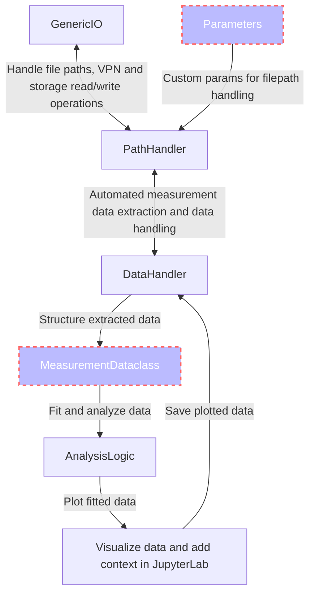
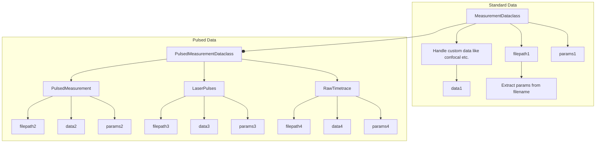

# Qudi Hira Analysis

A reproducible and transparent toolkit to analyze experimental data, primarily from an imaging magnetometer in diamond.

**Transparency** is achieved using Jupyter notebooks, which mix analysis code and figures along with written text and
equations. The
toolkit itself is built entirely on free and open-source software.

**Reproducibility** is achieved using automated build tools (GNU Make) and environment metadata storage. Two lines of
code are sufficient to reproduce all analyzed data and figures.

This license of this project is located in the top level folder under `LICENSE`. Some specific files contain their
individual licenses in the file header docstring.

## Schema

### Overall


### Measurement Dataclass


### Parameters

The `Parameters` dataclass in `parameters.py` contains the attributes about which computer is used and where the data is
stored. The code will automatically detect any VPN connection, and adjust its save location accordingly (Note that you 
cannot save to kernix when connected remotely).

| Attribute              | Explanation                                                                                                      |
|------------------------|------------------------------------------------------------------------------------------------------------------|
| `lab_computer_name`    | Name of lab computer, use `os.environ["COMPUTERNAME"]` (eg. PCKK022)                                             |
| `remote_datafolder`    | Folder to connect to when running analysis remotely (eg. over VPN) (default: `\\kernix\qudiamond\Data`)          |
| `remote_output_folder` | Folder to place output images when running remotely (eg. over VPN) (default: `$USER\Documents\QudiHiraAnalysis`) |
| `local_datafolder`     | Folder to connect to when running  locally (default: `Z:\Data`)                                                  |
| `local_output_folder   | Folder to place output images when running locally (default: `Z:\QudiHiraAnalysis`)                              |

## Examples

### Plot all confocal images

```python
from src.data_handler import DataHandler
import matplotlib.pyplot as plt

# Create instance of DataHandler and give it the measurement folder
data_handler = DataHandler(measurement_folder="20220621_FR0612-F2-2S6_uhv")
# Automatically walk through measurement folders and extract a list
# of confocal images each being an instance of MeasurementDataclass
confocal_list = data_handler.load_measurements_into_dataclass_list(measurement_str="Confocal")

# Set up matplotlib figure
fig, ax = plt.subplots(nrows=10)

# Loop over all confocal images
for idx, confocal in enumerate(confocal_list):
    # Plot each confocal image on a subplot row
    ax[idx].imshow(confocal.data)
    # Extract the z-height param from the name of file
    z_height = confocal.get_param_from_filename(unit="um")
    ax[idx].set_title(f"Z-Height = {z_height}")

# Save output image
data_handler.save_figures(fig, filename="compare_confocals_at different_z_heights")
```

### Plot all Rabi oscillations with exponentially decaying sinusoid fit

```python
from src.data_handler import DataHandler
from src.analysis_logic import AnalysisLogic
import matplotlib.pyplot as plt

data_handler = DataHandler(measurement_folder="20220621_FR0612-F2-2S6_uhv")
rabi_list = data_handler.load_measurements_into_dataclass_list(measurement_str="Rabi")

# Create instance of AnalysisLogic()
analysis = AnalysisLogic()

fig, ax = plt.subplots(nrows=10)

for idx, rabi in enumerate(rabi_list):
    # Plot each confocal image on a subplot row
    x, y = rabi.data["t(ns)"], rabi.data["spin_state"]

    # Fit data to an exponentially decaying sinusoid
    fit_x, fit_y, model = analysis.perform_fit(x, y, fit_function="sineexponentialdecay")

    ax[idx].plot(x, y)
    ax[idx].plot(fit_x, fit_y)

    # Extract the power param from the name of file
    power = rabi.get_param_from_filename(unit="dBm")

    # Title plot with power and T1rho time
    t1rho = model.best_fit.params["decay"]
    ax[idx].set_title(f"Power = {power}, T1rho = {t1rho}")

# Save output image
data_handler.save_figures(fig, filename="compare_rabis_at different_powers")
```

See [ExampleNotebook.ipynb](ExampleNotebook.ipynb) for more examples.

### Fits available

| Dimension | Fit                           |
|-----------|-------------------------------|
| 1d        | decayexponential              |
|           | biexponential                 |
|           | decayexponentialstretched     |
|           | gaussian                      |
|           | gaussiandouble                |
|           | gaussianlinearoffset          |
|           | hyperbolicsaturation          |
|           | linear                        |
|           | lorentzian                    |
|           | lorentziandouble              |
|           | lorentziantriple              |
|           | sine                          |
|           | sinedouble                    |
|           | sinedoublewithexpdecay        |
|           | sinedoublewithtwoexpdecay     |
|           | sineexponentialdecay          |
|           | sinestretchedexponentialdecay |
|           | sinetriple                    |
|           | sinetriplewithexpdecay        |
|           | sinetriplewiththreeexpdecay   |
| 2d        | twoDgaussian                  |

## Getting Started

### Prerequisites

Latest version of the [conda](https://docs.conda.io/en/latest/miniconda.html) package manager.

### Clone the repository

#### With Git

```shell
git clone https://github.com/dineshpinto/qudi-hira-analysis.git
```

#### With Github CLI

```shell
gh repo clone dineshpinto/qudi-hira-analysis
```

### Installing dependencies

#### Creating the conda environment

```shell
conda env create -f tools/conda-env-xx.yml
```

where `xx` is either `win10` or `osx`.

#### Activate environment

```shell
conda activate qudi-hira-analysis
```

#### Add conda environment to Jupyter kernel

```shell
python -m ipykernel install --user --name=qudi-hira-analysis
```

### Start the analysis

```shell
jupyter lab
```

### Notes

If exporting environments:

```shell
conda env export --no-builds > tools/conda-env-xx.yml
```

## Makefile options

The Makefile is configured to generate a variety of outputs:

+ `make pdf` : Converts all notebooks to PDF (requires LaTeX backend)
+ `make html`: Converts all notebooks to HTML files
+ `make py`  : Converts all notebooks to Python files (useful for VCS)
+ `make all` : Sequentially runs all the notebooks in folder

To use the `make` command on Windows you can install [Chocolatey](https://chocolatey.org/install), then
run `choco install make`
