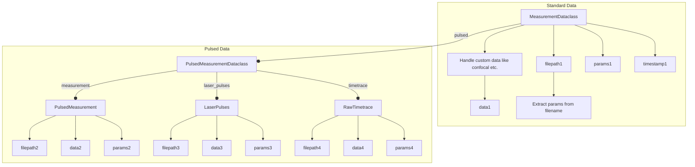

# Qudi Hira Analysis

This toolkit automates a large portion of the work surrounding data analysis on quantum sensing experiments where the
primary raw data extracted is photon counts.

The high level interface is abstracted, and provides a set of functions to automate data import, handling and analysis.
It is designed to be exposed through Jupyter Notebooks, although the abstract interface allows it to be integrated into
larger, more general frameworks as well (with only some pain). Using the toolkit itself should only require a
beginner-level understanding of Python.

It also aims to improve transparency and reproducibility in experimental data analysis. In an ideal scenario,
two lines of code are sufficient to recreate all output data.

Python offers some very handy features like dataclasses, which are heavily used by this toolkit. Dataclasses offer a
full OOP (object oriented programming) experience while analyzing complex data sets. They provide a solid and
transparent structure to the data to
reduce errors arising from data fragmentation. This generally comes at a large performance cost, but this is (largely)
sidestepped by lazy loading data and storing metadata instead wherever possible.

The visual structure of the toolkit is shown in the schema below. It largely consists of three portions:

- `IOHandler` assumes a central store of raw data, which is never modified (read-only)
- `DataHandler` automates the extraction of large amounts of data from the `IOHandler` interface
- `AnalysisLogic` contains a set of automated fitting routines using `lmfit` internally (built on top of fitting
  routines from the [qudi](https://github.com/Ulm-IQO/qudi) project)

This license of this project is located in the top level folder under `LICENSE`. Some specific files contain their
individual licenses in the file header docstring.

## Schema

### Overall


### Measurement Dataclass



### Parameters

The `Parameters` dataclass in `parameters.py` contains the attributes about which computer is used and where the data is
stored. The code will automatically detect any VPN connection, and adjust its save location accordingly (Note that you
cannot save to kernix when connected remotely).

| Attribute              | Explanation                                                                                                      |
|------------------------|------------------------------------------------------------------------------------------------------------------|
| `lab_computer_name`    | Name of lab computer, use `os.environ["COMPUTERNAME"]` (eg. PCKK022)                                             |
| `remote_datafolder`    | Folder to connect to when running analysis remotely (eg. over VPN) (default: `\\kernix\qudiamond\Data`)          |
| `remote_output_folder` | Folder to place output images when running remotely (eg. over VPN) (default: `$USER\Documents\QudiHiraAnalysis`) |
| `local_datafolder`     | Folder to connect to when running  locally (default: `Z:\Data`)                                                  |
| `local_output_folder`  | Folder to place output images when running locally (default: `Z:\QudiHiraAnalysis`)                              |

### AnalysisLogic fits

| Dimension | Fit                           |
|-----------|-------------------------------|
| 1d        | decayexponential              |
|           | biexponential                 |
|           | decayexponentialstretched     |
|           | gaussian                      |
|           | gaussiandouble                |
|           | gaussianlinearoffset          |
|           | hyperbolicsaturation          |
|           | linear                        |
|           | lorentzian                    |
|           | lorentziandouble              |
|           | lorentziantriple              |
|           | sine                          |
|           | sinedouble                    |
|           | sinedoublewithexpdecay        |
|           | sinedoublewithtwoexpdecay     |
|           | sineexponentialdecay          |
|           | sinestretchedexponentialdecay |
|           | sinetriple                    |
|           | sinetriplewithexpdecay        |
|           | sinetriplewiththreeexpdecay   |
| 2d        | twoDgaussian                  |

## Example: Plot all confocal images taken in May 2022

```python
from dateutil.parser import parse
import matplotlib.pyplot as plt
from src.data_handler import DataHandler

data_handler = DataHandler(measurement_folder="20220621_FR0612-F2-2S6_uhv")
confocal_list = data_handler.load_measurements_into_dataclass_list(measurement_str="Confocal")

confocals_in_may = [confocal for confocal in confocal_list if confocal.timestamp.month == parse("May 2022").month]

fig, ax = plt.subplots(nrows=len(confocals_in_may))

for idx, confocal in enumerate(confocals_in_may):
    ax[idx].imshow(confocal.data)
    ax[idx].set_title(f"Laser power = {confocal.get_param_from_filename(unit='mW')}")

data_handler.save_figures(fig, filename="compare_confocals_at different_laser_powers")
```

See [ExampleNotebook.ipynb](ExampleNotebook.ipynb) for more examples.

## Getting Started

### Prerequisites

Latest version of the [conda](https://docs.conda.io/en/latest/miniconda.html) package manager and
[git](https://git-scm.com/downloads) version control system.

### Clone the repository

#### With Git

```shell
git clone https://github.com/dineshpinto/qudi-hira-analysis.git
```

#### With Github CLI

```shell
gh repo clone dineshpinto/qudi-hira-analysis
```

### Installing dependencies

#### Creating the conda environment

```shell
conda env create -f tools/conda-env-xx.yml
```

where `xx` is either `win10` or `osx`. Note: `osx` was tested on Apple Silicon M1.

#### Activate environment

```shell
conda activate qudi-hira-analysis
```

#### Add conda environment to Jupyter kernel

```shell
python -m ipykernel install --user --name=qudi-hira-analysis
```

### Start the analysis

```shell
jupyter lab
```

## Makefile options

The Makefile is configured to generate a variety of outputs:

+ `make pdf` : Converts all notebooks to PDF (requires LaTeX backend)
+ `make html`: Converts all notebooks to HTML files
+ `make py`  : Converts all notebooks to Python files (useful for VCS)
+ `make all` : Sequentially runs all the notebooks in folder

To use the `make` command on Windows you can install [Chocolatey](https://chocolatey.org/install), then
install make with `choco install make`
