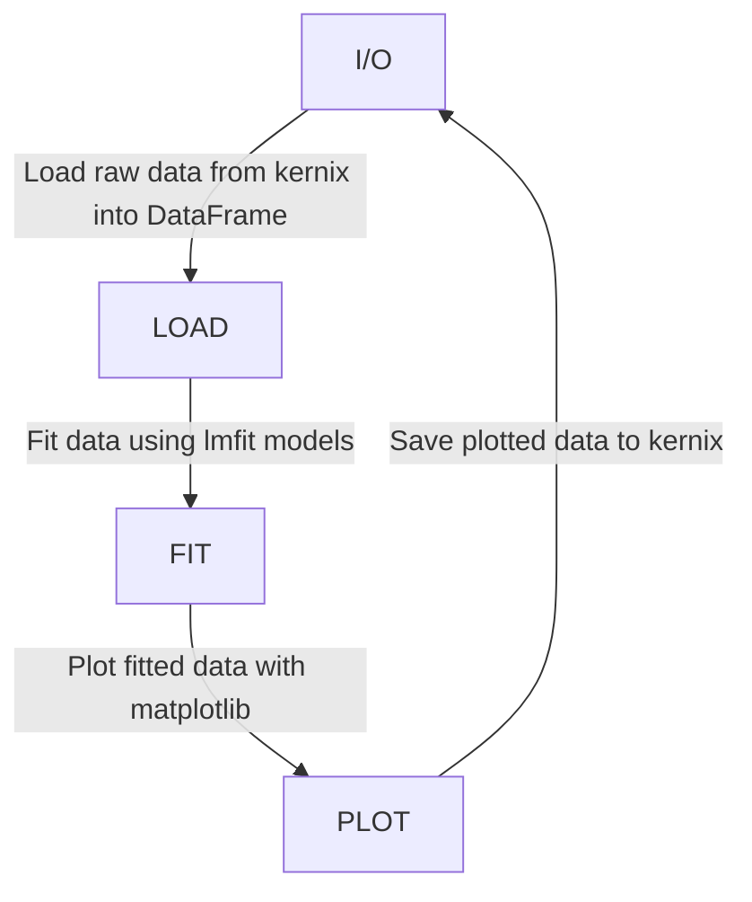

# qudiamond-analysis

 A reproducible and transparent toolkit to analyze experimental data, primarily from an imaging magnetometer in diamond.

**Transparency** is achieved using Jupyter notebooks, which mix analysis code and figures along with written texts. The toolkit itself is built entirely on free and open-source software.

**Reproducibility** is achieved using automated build tools (GNU Make) and environment metadata storage. Two lines of code are sufficient to reproduce all analyzed data and figures.

This license of this project is located in the top level folder under `LICENSE`. Some specific files contain their individual licenses in the file header docstring.

## Layout
+ JupyterLab notebooks are stored in `notebooks/`
+ Reusable code is stored in `src/`
  + `io.py` Reading and writing data and figures
  + `fitting.py` and `qudi_fit_wrapper.py` Set of (semi)-automated fitting routines
+ Utilities such as automated copy scripts, conda envs etc. are stored in `tools/`


## Schema



Example code to plot and fit all autocorrelation measurements for a particular experiment.

```python
import src.io as sio
import src.fitting as sft

# Measurement folder on kernix, to ensure reproducibility DO NOT copy raw data elsewhere 
DATA_FOLDERPATH, FIGURE_FOLDERPATH = sio.get_data_and_figure_paths("20220112_SingleNV_Membrane_RT")

# Get all filepaths corresponding to autocorrelation measurements
autocorr_filepaths, _ = sio.get_measurement_file_list(DATA_FOLDERPATH, measurement="Autocorrelation")

# Set up matplotlib figure
fig, ax = plt.subplots()

for filepath in autocorr_filepaths:
    # Load raw measurement data into a pandas DataFrame  
    df = sio.read_into_df(filepath)
    x = df["Time (ps)"] / 1e3
    y = df["g2(t) norm"]
    # Fit raw data to an autocorrelation curve
    autocorr_fit = sft.autocorrelation_fit(x, y)
    # Plot raw and fitted data
    ax.plot(x, y, ".")
    ax.plot(x, autocorr_fit["fit"])

# Save figures to kernix
sio.save_figures("autocorr_comparison", FIGURE_FOLDERPATH)
```

## Prerequisites
- Python 3.10 or higher
- Conda 4.11 or higher

## Getting Started 

### Clone the repository

#### With Git
```shell
git clone https://github.com/dineshpinto/qudiamond-analysis.git
```

#### With Github CLI
```shell
gh repo clone dineshpinto/qudiamond-analysis
```

### Installing dependencies

#### Creating the conda environment
```shell
conda env create -f tools/conda-env-xx.yml
```
where `xx` is either `win10` or `macm1`.

#### Activate environment
```shell
conda activate analysis
```

#### Add conda environment to Jupyter kernel
```shell
python -m ipykernel install --user --name=analysis
```

### Start the analysis
```shell
jupyter lab
```

### Notes
- If exporting environments: ```conda env export --no-builds > tools/conda-env.yml```


## Makefile options
The Makefile is configured to generate a variety of outputs:

+ `make pdf` : Converts all notebooks to PDF (requires LaTeX backend)
+ `make html`: Converts all notebooks to HTML files
+ `make py`  : Converts all notebooks to Python files (useful for VCS)
+ `make all` : Sequentially runs all the notebooks in folder
