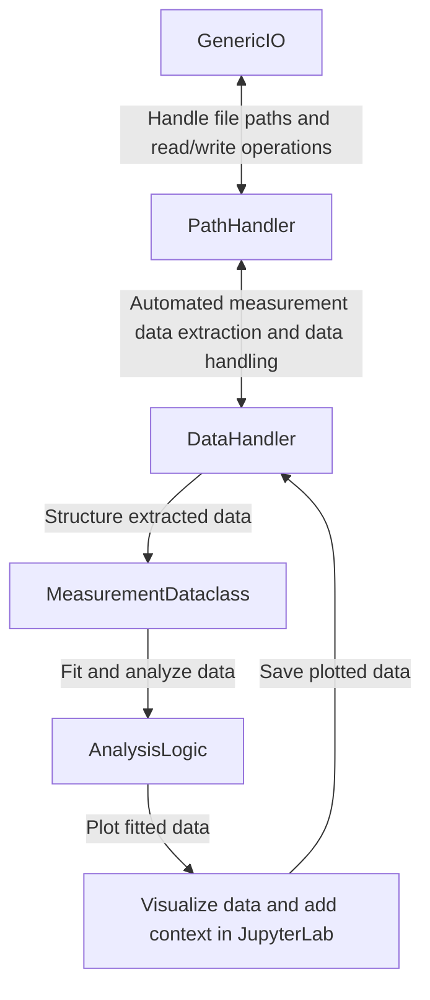

# qudiamond-analysis

 A reproducible and transparent toolkit to analyze experimental data, primarily from an imaging magnetometer in diamond.

**Transparency** is achieved using Jupyter notebooks, which mix analysis code and figures along with written texts. The toolkit itself is built entirely on free and open-source software.

**Reproducibility** is achieved using automated build tools (GNU Make) and environment metadata storage. Two lines of code are sufficient to reproduce all analyzed data and figures.

This license of this project is located in the top level folder under `LICENSE`. Some specific files contain their individual licenses in the file header docstring.


## Schema



## Examples

### Plot confocal images

```python
import src.io as sio
import src.fitting as sft
import src.analysis_logic as analysis
import matplotlib.pyplot as plt

# Create instance of DataHandler and give it the measurement folder
data_handler = DataHandler(measurement_folder="FR0213-UHV")
# Automatically walk through measurement folders and extract a list
# of confocal images each being an instance of MeasurementDataclass
confocal_list = data_handler.load_measurements_into_dataclass_list(measurement_str="Confocal")

# Set up matplotlib figure
fig, ax = plt.subplots(nrows=10)

# Loop over all confocal images
for idx, confocal in enumerate(confocal_list):
    # Plot each confocal image on a subplot row
    ax[idx].imshow(confocal.data)
    # Extract the z-height param from the name of file
    z_height = confocal.get_param_from_filename(unit="um")
    ax[idx].set_title(f"Z-Height = {z_height}")

# Save output image
data_handler.save_figures(fig, filename="compare_confocals_at different_z_heights")
```

### Plot Rabi with sinusoid exponential decay fit

```python
data_handler = DataHandler(measurement_folder="FR0213-UHV")
rabi_list = data_handler.load_measurements_into_dataclass_list(measurement_str="Rabi")

fig, ax = plt.subplots(nrows=10)

for idx, rabi in enumerate(rabi_list):
    # Plot each confocal image on a subplot row
    x = rabi["t(ns)"]
    y = rabi["spin_state"]
    
    fit_x, fit_y, model = analysis.perform_fit(x, y, fit_function="sineexponentialdecay")
    
    ax[idx].plot(x, y)
    ax[idx].plot(fit_x, fit_y)
    
    # Extract the power param from the name of file
    power = rabi.get_param_from_filename(unit="dBm")
    
    # Title plot with power and T1rho time
    t1rho = model.best_fit.
    ax[idx].set_title(f"Power = {power}, T1rho = {}")

# Save output image
data_handler.save_figures(fig, filename="compare_rabis_at different_powers")
```


## Prerequisites
- Python 3.10 or higher
- Conda 4.11 or higher

## Getting Started 

### Clone the repository

#### With Git
```shell
git clone https://github.com/dineshpinto/qudiamond-analysis.git
```

#### With Github CLI
```shell
gh repo clone dineshpinto/qudiamond-analysis
```

### Installing dependencies

#### Creating the conda environment
```shell
conda env create -f tools/conda-env-xx.yml
```
where `xx` is either `win10` or `macm1`.

#### Activate environment
```shell
conda activate analysis
```

#### Add conda environment to Jupyter kernel
```shell
python -m ipykernel install --user --name=analysis
```

### Start the analysis
```shell
jupyter lab
```

### Notes
- If exporting environments: ```conda env export --no-builds > tools/conda-env.yml```


## Makefile options
The Makefile is configured to generate a variety of outputs:

+ `make pdf` : Converts all notebooks to PDF (requires LaTeX backend)
+ `make html`: Converts all notebooks to HTML files
+ `make py`  : Converts all notebooks to Python files (useful for VCS)
+ `make all` : Sequentially runs all the notebooks in folder
